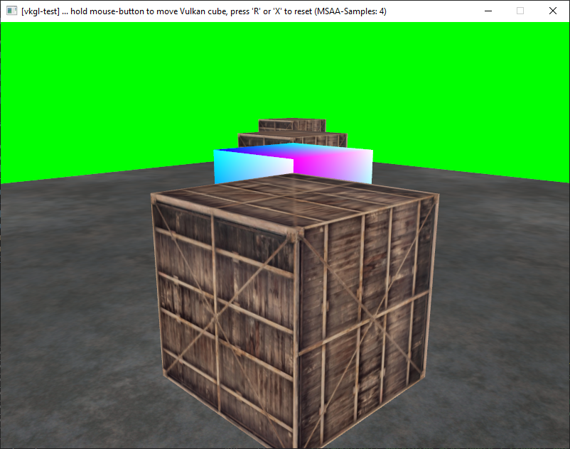
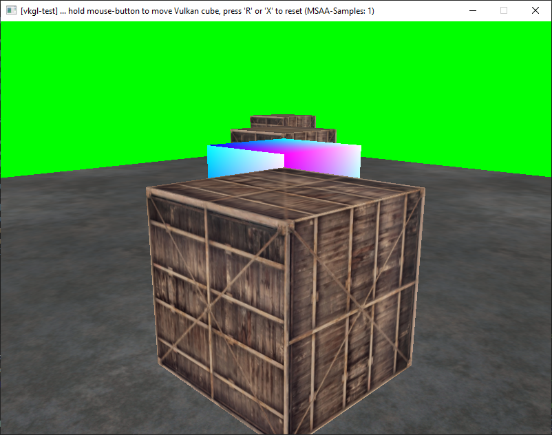

# vkgl-test

> This is a very basic test application that uses the available OpenGL & Vulkan interop extensions to render some parts of a scene using OpenGL, and render other parts of the scene using Vulkan.  
> An OpenGL Framebuffer-Object and a Vulkan Framebuffer/RenderPass are using shared color- & depth-stencil texture attachments (so there is no per-frame texture-blitting or memory-copying involved)  
> Both APIs always render directly into the shared color- & depth-stencil textures.  
> Also both APIs are using the typical depth-buffer z-write/z-test provided by the GPU.  
> Synchronization between the OpenGL and Vulkan APIs is performed using shared device-queue semaphores.

Used extensions:
* [GL_EXT_external_objects](https://registry.khronos.org/OpenGL/extensions/EXT/EXT_external_objects.txt) (GL_EXT_memory_object, GL_EXT_semaphore)
    * [GL_EXT_external_objects_win32](https://registry.khronos.org/OpenGL/extensions/EXT/EXT_external_objects_win32.txt)
    * [GL_EXT_external_objects_fd](https://registry.khronos.org/OpenGL/extensions/EXT/EXT_external_objects_fd.txt)
* [VK_KHR_external_memory](https://registry.khronos.org/vulkan/specs/1.3-extensions/man/html/VK_KHR_external_memory.html)
    * [VK_KHR_external_memory_win32](https://registry.khronos.org/vulkan/specs/1.3-extensions/man/html/VK_KHR_external_memory_win32.html)
    * [VK_KHR_external_memory_fd](https://registry.khronos.org/vulkan/specs/1.3-extensions/man/html/VK_KHR_external_memory_fd.html)
* [VK_KHR_external_semaphore](https://registry.khronos.org/vulkan/specs/1.3-extensions/man/html/VK_KHR_external_semaphore.html)
    * [VK_KHR_external_semaphore_win32](https://registry.khronos.org/vulkan/specs/1.3-extensions/man/html/VK_KHR_external_semaphore_win32.html)
    * [VK_KHR_external_semaphore_fd](https://registry.khronos.org/vulkan/specs/1.3-extensions/man/html/VK_KHR_external_semaphore_fd.html)

# Status

* NVidia
    * ✔️ MSAA `OFF`
    * ✔️ MSAA `ON`
* AMD
    * ✔️ MSAA `OFF`
    * ❌ MSAA `ON` ... driver crashes/freezes
* Intel
    * TBD

It looks like the AMD driver crashes/freezes in the `glWaitSemaphoreEXT()` or `glSignalSemaphoreEXT()` calls in `vk-render.cpp`

# Screenshots

### With MSAA



### No MSAA



# Setup & build
### Bootstrap vcpkg (only needed once)

```
.\vcpkg\bootstrap-vcpkg.bat
OR
./vcpkg/bootstrap-vcpkg.sh
```

### Configure CMake
```
cmake . -Bbuild
```

### Build using CMake
```
cmake --build build
```

### Open project in IDE
```
cmake --open build
```
